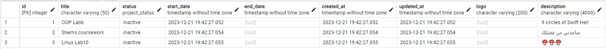
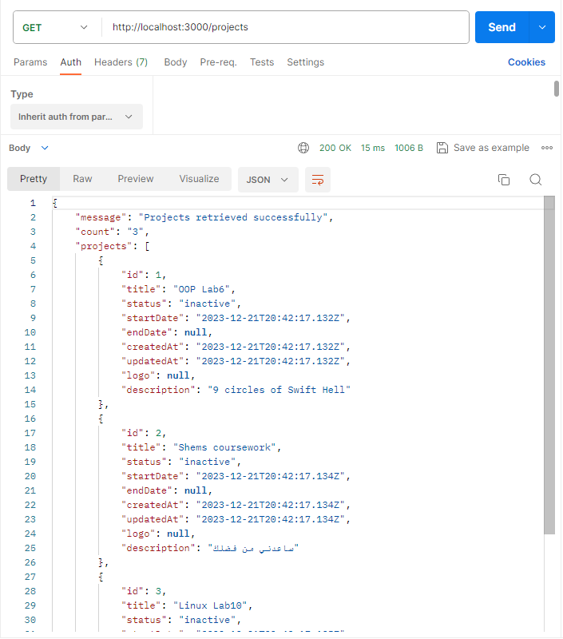
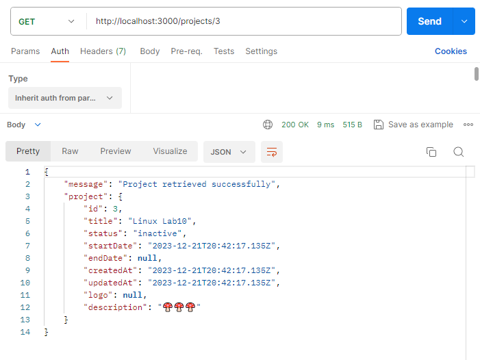
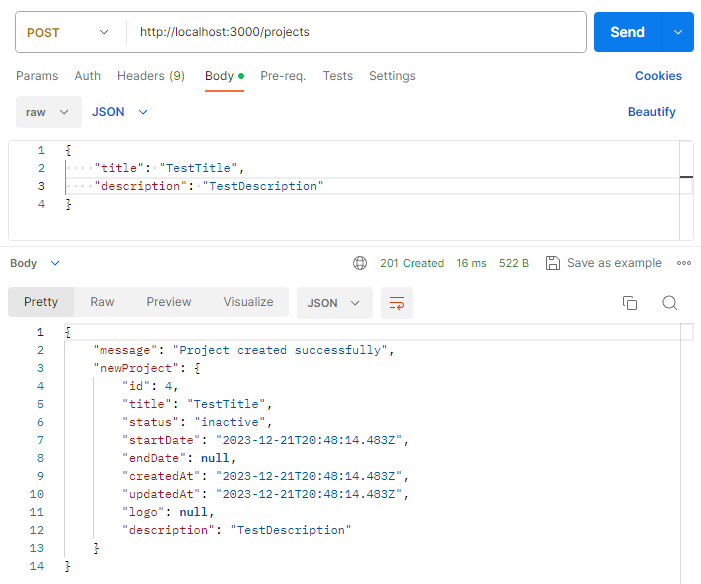
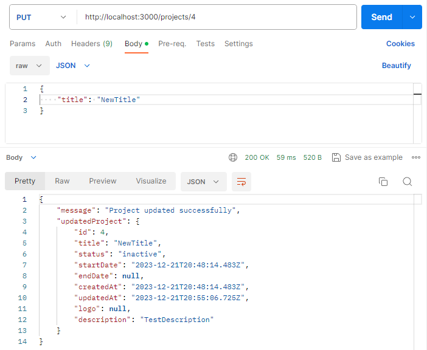
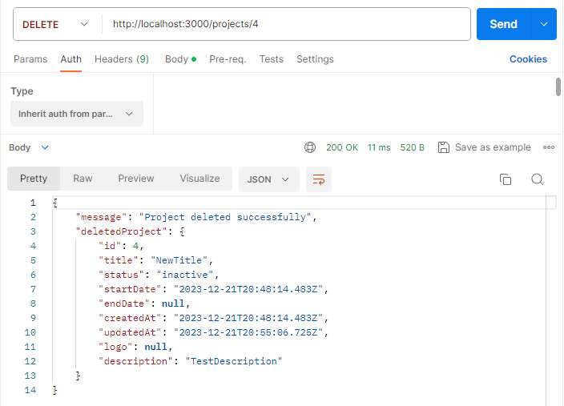
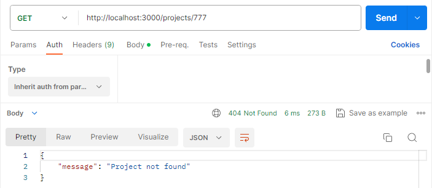
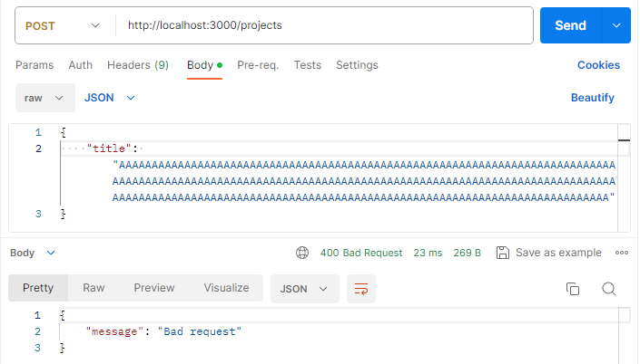

# Тестування працездатності системи

Для тестування було використано платформу Postman.

## Початкове наповнення бази даних для проєктів

## Тестування запитів для проєктів

### Get (all)

### Get (one)

### Post

### Put

### Delete

## Обробка помилок для проєктів

### Not found

### Bad request

